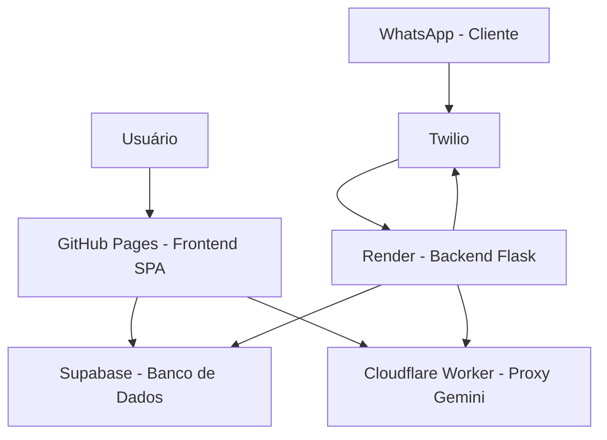
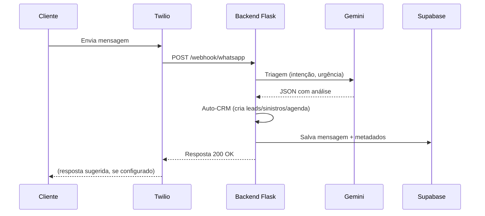
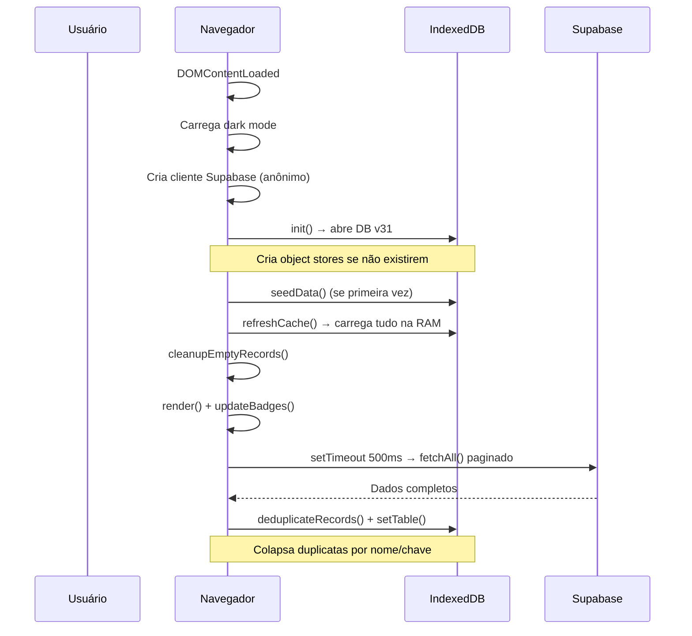
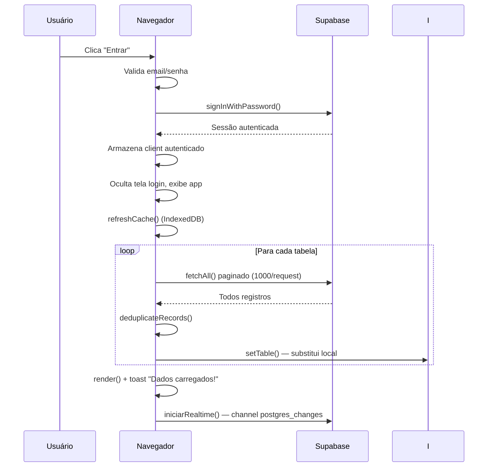
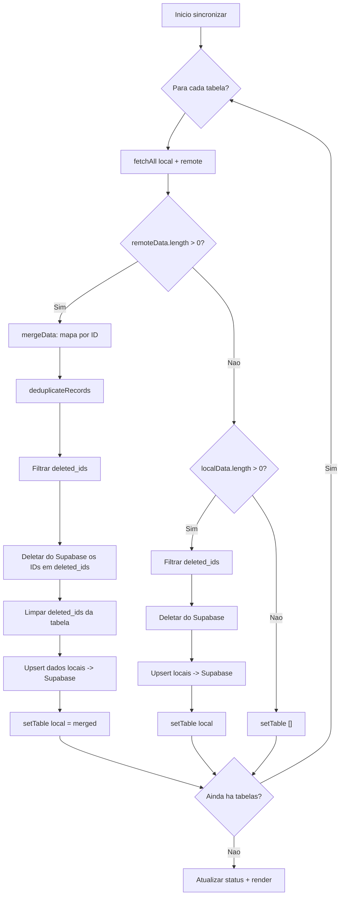
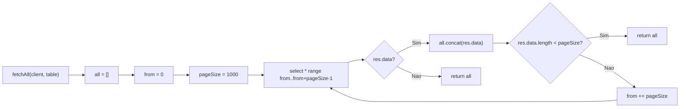
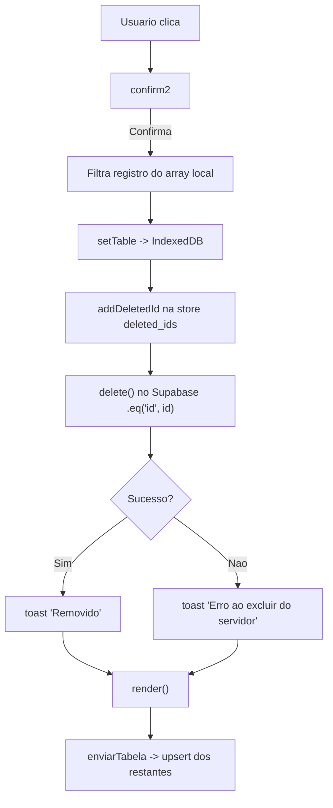
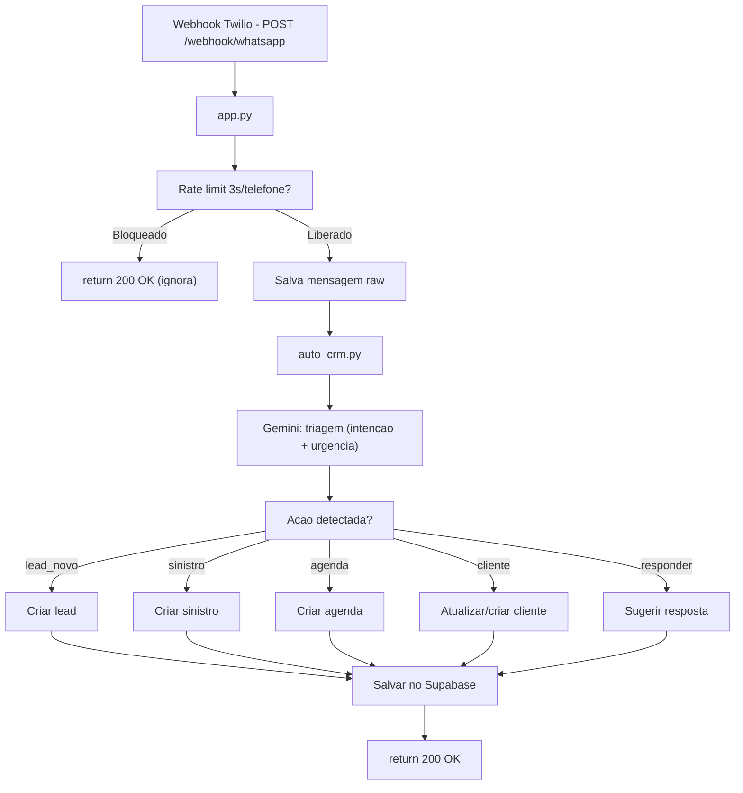
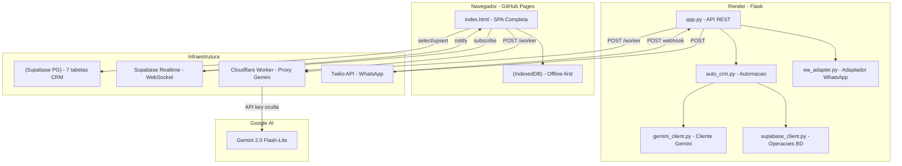
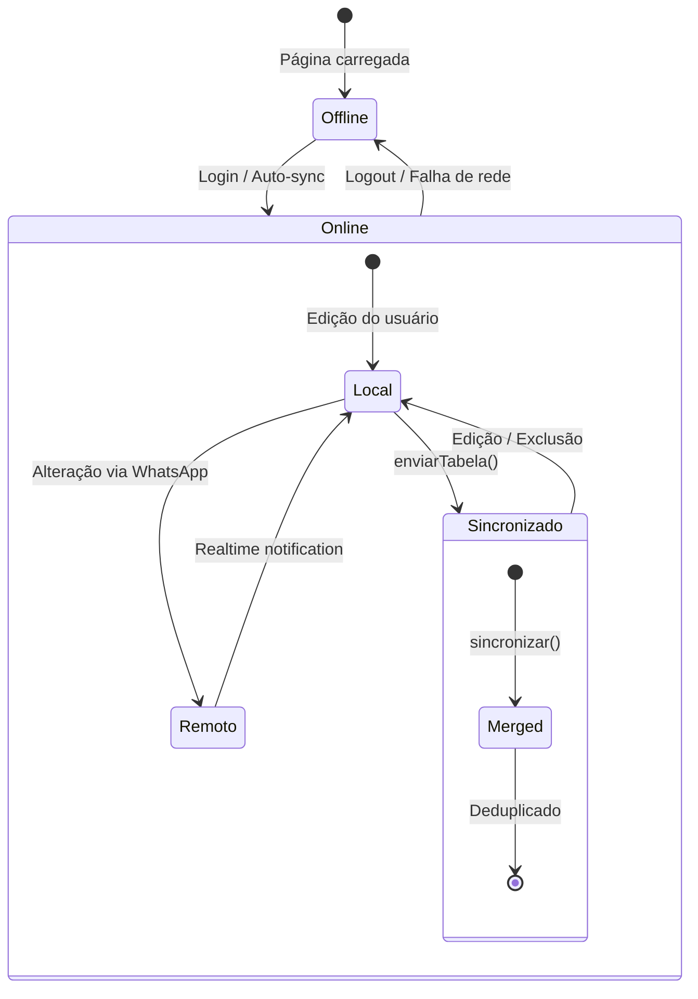

# JAF CRM

Sistema de gestão de seguros completo com CRM, integração WhatsApp e inteligência artificial.

[](https://github.com/Tinho2508/JAF-CRM)
[](https://tinho2508.github.io/JAF-CRM/)
[](https://jaf-crm-backend.onrender.com)
[](https://supabase.com)
[](https://ai.google.dev)
[](https://twilio.com)


---

## Visão Geral

O **JAF CRM** é um sistema completo para corretoras de seguros, desenvolvido para gerenciar clientes, apólices, propostas, leads, produção, comissões, sinistros e agenda — tudo integrado com WhatsApp e inteligência artificial.



### Arquitetura

| Camada | Tecnologia | Função |
|--------|-----------|--------|
| **Frontend** | HTML5 + CSS3 + JavaScript (SPA) | Interface do usuário, offline-first com IndexedDB |
| **Backend** | Flask (Python) | Webhook WhatsApp, API REST, integração Gemini |
| **Banco** | Supabase (PostgreSQL) | Armazenamento cloud, Realtime, autenticação |
| **IA** | Google Gemini 2.0 Flash-Lite | Triagem de mensagens, sugestão de respostas |
| **WhatsApp** | Twilio API | Envio/recebimento de mensagens |
| **Proxy** | Cloudflare Worker | Segurança da chave Gemini |

---

## Funcionalidades

### 📊 Dashboard
- KPIs: total de clientes, apólices ativas, produção do mês, comissões, leads, renovações
- Gráficos por ramo, produto e evolução mensal
- Top clientes por prêmio total
- Alertas de renovações urgentes (7 e 30 dias)
- Filtro por mês/ano

### 👥 Clientes
- Cadastro completo com CPF/CNPJ, telefone, WhatsApp, e-mail, cidade
- Distribuição automática de registros da produção
- Botão WhatsApp direto na listagem
- Visão 360°: apólices, propostas, leads, sinistros, agenda

### 📄 Apólices
- Cadastro com prêmio, comissão (cálculo automático), vigência, vencimento
- Status: Ativa, Cancelada, Suspensa
- Links rápidos para WhatsApp (renovação, cobrança)

### 🎯 Leads
- Pipeline visual em Kanban: Novo → Em Contato → Proposta Enviada → Negociação → Fechado
- Filtro por status, mês, ano
- Automação: leads criados automaticamente via WhatsApp

### 💰 Produção
- Registro de produção com valor, comissão, IOF, parcela
- Deduplicação inteligente (agrupa por nome+data+valor)
- Distribuição para clientes, propostas e apólices
- Filtro por mês/ano

### 💵 Comissões
- Totalização por período
- Detalhamento por produto
- Gráfico de barras mensal

### 📅 Agenda
- Tarefas: ligação, WhatsApp, e-mail, reunião, renovação, visita
- Status: agendado, concluído, cancelado
- Alertas de atraso
- Criação automática via WhatsApp

### ⚠️ Sinistros
- Registro com tipo, valor estimado, status
- Tipos: colisão, roubo/furto, incêndio, alagamento, etc.
- Criação automática via WhatsApp

### 🔄 Renovações
- Pipeline por urgência: 7, 15, 30, 60 dias
- Botão WhatsApp com template automático

### 📈 Relatórios
- Totalizações: premio, comissão, leads, propostas
- Ticket médio, taxa de conversão
- Filtro por mês/ano

### 💬 Mensagens WhatsApp
- Histórico completo de conversas
- Identificação de intenção via IA
- Cores por urgência (alta, média, baixa)
- Simulador de webhook para testes
- Integração com Twilio

### 🤖 Assistente IA (Gemini)
- Comandos de voz e texto
- Localizar clientes, apólices, leads
- Navegar entre páginas
- Contar registros com filtros
- Criar leads e tarefas
- Acessível pelo botão flutuante "AI"

---

## Tecnologias

### Frontend
- **HTML5** + **CSS3** (variáveis, flexbox, grid, animações)
- **JavaScript** (ES6+ assíncrono, IndexedDB)
- **SheetJS (XLSX)** — importação/exportação de planilhas
- **Supabase JS v2** — cliente Supabase no browser
- Design responsivo com **dark mode**

### Backend
- **Flask** — framework web Python
- **Supabase Python** — cliente Supabase server-side
- **Google Generative AI** — cliente Gemini (via proxy)
- **Gunicorn** — servidor WSGI de produção
- **Render** — hospedagem cloud

### Infraestrutura
- **Supabase** — PostgreSQL, autenticação, Realtime
- **GitHub Pages** — deploy contínuo do frontend
- **Render** — deploy do backend Flask
- **Cloudflare Workers** — proxy seguro para Gemini
- **Twilio** — API WhatsApp Business

---

## Estrutura do Projeto

```
JAF-CRM/
├── frontend/
│   └── index.html          # Aplicação SPA completa
├── backend/
│   ├── app.py              # Servidor Flask (webhook + API)
│   ├── auto_crm.py         # Automação CRM via WhatsApp
│   ├── gemini_client.py    # Cliente Gemini via proxy
│   ├── supabase_client.py  # Operações com Supabase
│   ├── wa_adapter.py       # Adaptador de provedores WhatsApp
│   ├── requirements.txt    # Dependências Python
│   ├── render.yaml         # Config Render
│   ├── Procfile            # Comando de start
│   ├── migration_whatsapp_messages.sql  # DDL tabela mensagens
│   └── migration_rls_policies.sql       # Políticas RLS
├── worker/
│   └── worker.js           # Cloudflare Worker (proxy Gemini)
├── .github/workflows/
│   └── deploy-pages.yml    # GitHub Actions (deploy frontend)
└── README.md
```

---

## Fluxo de Mensagens WhatsApp



---

## Sincronização

O sistema opera **offline-first**: os dados ficam no IndexedDB do navegador e sincronizam com o Supabase em segundo plano.

- ✅ **Auto-sync** ao abrir o app
- ✅ **Forçar Download** — substitui dados locais pelo servidor
- ✅ **Enviar ao Supabase** — upload local → cloud
- ✅ **Sincronizar** — merge bidirecional com deduplicação
- ✅ **Backup/restore** via JSON
- ✅ **Importação** de planilhas Excel (.xlsx)

---

## Lógica do Sistema e Algoritmos

### 1. Fluxo de Inicialização (initApp)



### 2. Fluxo de Login (fazerLogin → entrarApp)



### 3. Algoritmo de Sincronização (sincronizar)

O merge bidirecional entre IndexedDB e Supabase:



**Algoritmo mergeData:**
```
Entrada: local (Array), remote (Array)
Saída:   Array mesclado

mapa = {}
para cada item em local:
    mapa[item.id] = item
para cada item em remote:
    mapa[item.id] = item
retornar Object.values(mapa)
```
- União por ID: registros locais e remotos com o mesmo ID são mesclados (remoto sobrescreve local)
- Garante que nenhum registro seja perdido

**Algoritmo deduplicateRecords:**
```
Entrada: tabela (string), data (Array)
Saída:   Array sem duplicatas

chaves = {
  clientes: 'nome',
  apolices: 'numero_apolice',
  leads:    'nome_cliente',
  propostas:'numero_proposta'
}
key = chaves[tabela] ou null
se key for null: retornar data

vistos = {}  // mapa: valor_normalizado → registro
unicos = []
para cada item em data:
    val = item[key]
    se val vazio: adicionar a unicos; continuar
    normalizado = val.trim().toLowerCase()
    se não está em vistos:
        vistos[normalizado] = item
        adicionar a unicos
    senão:
        existente = vistos[normalizado]
        se item.criado_em >= existente.criado_em:
            substituir existente por item em unicos
            vistos[normalizado] = item
retornar unicos
```
- Mantém o registro **mais recente** (por `criado_em`) quando encontra o mesmo nome
- Preserva registros sem valor na chave (não os descarta)
- Tabelas sem chave definida (producao, sinistros, agenda) não são deduplicadas

### 4. Algoritmo de Paginação (fetchAll)



```javascript
async function fetchAll(client, table) {
  var all = [];
  var from = 0;
  var pageSize = 1000;
  while (true) {
    var res = await client
      .from(table)
      .select('*')
      .range(from, from + pageSize - 1);
    if (res.error || !res.data || !res.data.length) break;
    all = all.concat(res.data);
    if (res.data.length < pageSize) break;
    from += pageSize;
  }
  return all;
}
```
- Supabase limita `select('*')` a 1000 linhas por requisição
- `fetchAll` faz requisições sequenciais com `.range()` até obter menos de 1000 linhas
- Usado em: `entrarApp`, `initApp` (auto-sync), `sincronizar`, `forcarDownload`

### 5. Fluxo de Exclusão com Deleção Remota



- `deleted_ids` é uma object store separada no IndexedDB
- Usada pelo `sincronizar()` para deletar registros órfãos do Supabase
- Após delete bem-sucedido no Supabase, `deleted_ids` são limpos na sincronização

### 6. Estratégia de Políticas RLS (Row Level Security)

```sql
-- Para cada tabela CRM (clientes, apolices, etc.):
CREATE POLICY "auth_select" ON public.clientes
  FOR SELECT USING (auth.role() = 'authenticated');
CREATE POLICY "auth_insert" ON public.clientes
  FOR INSERT WITH CHECK (auth.role() = 'authenticated');
CREATE POLICY "auth_update" ON public.clientes
  FOR UPDATE USING (auth.role() = 'authenticated')
            WITH CHECK (auth.role() = 'authenticated');
CREATE POLICY "auth_delete" ON public.clientes
  FOR DELETE USING (auth.role() = 'authenticated');
```

- **4 políticas independentes** por tabela (vs. `FOR ALL` sem `WITH CHECK` que bloqueava INSERT)
- `USING` → controla quais linhas são visíveis/afetadas (SELECT, UPDATE, DELETE)
- `WITH CHECK` → controla quais novas linhas podem ser inseridas (INSERT, UPDATE)
- Autenticação feita via `supabase.auth.signInWithPassword()` no frontend
- Tabela `whatsapp_messages` usa política `FOR ALL` para anon (webhook público)

### 7. Arquitetura do Auto-CRM (Backend)



**Fluxo de triagem Gemini:**
```
Mensagem do cliente → POST /worker (proxy)
  → Gemini 2.0 Flash-Lite analisa:
    - intenção (lead_novo, sinistro, agendar, etc.)
    - urgência (alta, media, baixa)
    - dados estruturados extraídos
    - resposta sugerida
  → Backend executa ações no CRM
  → Salva tudo em whatsapp_messages
```

### 8. Diagrama de Componentes (Visão 360°)



### 9. Diagrama de Estados (Registros)



---

## Direitos Autorais

© 2026 JAF CRM. Todos os direitos reservados.


