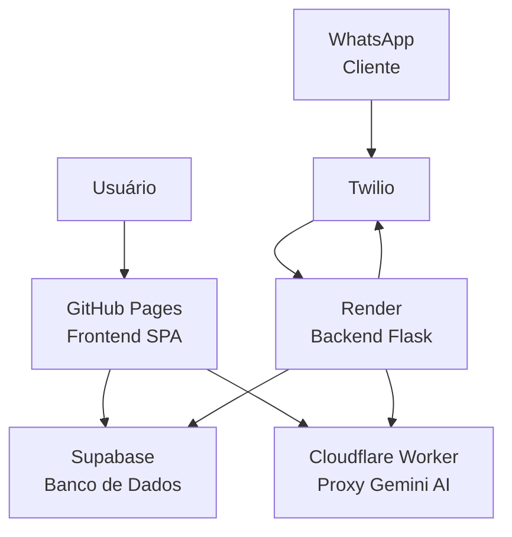
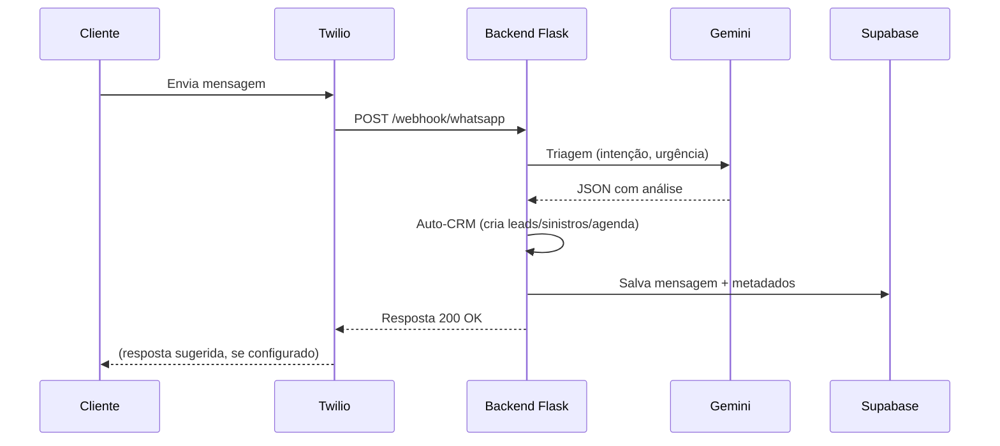

# JAF CRM

Sistema de gestão de seguros completo com CRM, integração WhatsApp e inteligência artificial.

[](https://tinho2508.github.io/JAF-CRM/)
[](https://jaf-crm-backend.onrender.com)
[](https://supabase.com)
[](https://ai.google.dev)
[](https://twilio.com)
[](LICENSE)

---

## Visão Geral

O **JAF CRM** é um sistema completo para corretoras de seguros, desenvolvido para gerenciar clientes, apólices, propostas, leads, produção, comissões, sinistros e agenda — tudo integrado com WhatsApp e inteligência artificial.



### Arquitetura

| Camada | Tecnologia | Função |
|--------|-----------|--------|
| **Frontend** | HTML5 + CSS3 + JavaScript (SPA) | Interface do usuário, offline-first com IndexedDB |
| **Backend** | Flask (Python) | Webhook WhatsApp, API REST, integração Gemini |
| **Banco** | Supabase (PostgreSQL) | Armazenamento cloud, Realtime, autenticação |
| **IA** | Google Gemini 2.0 Flash-Lite | Triagem de mensagens, sugestão de respostas |
| **WhatsApp** | Twilio API | Envio/recebimento de mensagens |
| **Proxy** | Cloudflare Worker | Segurança da chave Gemini |

---

## Funcionalidades

### 📊 Dashboard
- KPIs: total de clientes, apólices ativas, produção do mês, comissões, leads, renovações
- Gráficos por ramo, produto e evolução mensal
- Top clientes por prêmio total
- Alertas de renovações urgentes (7 e 30 dias)
- Filtro por mês/ano

### 👥 Clientes
- Cadastro completo com CPF/CNPJ, telefone, WhatsApp, e-mail, cidade
- Distribuição automática de registros da produção
- Botão WhatsApp direto na listagem
- Visão 360°: apólices, propostas, leads, sinistros, agenda

### 📄 Apólices
- Cadastro com prêmio, comissão (cálculo automático), vigência, vencimento
- Status: Ativa, Cancelada, Suspensa
- Links rápidos para WhatsApp (renovação, cobrança)

### 🎯 Leads
- Pipeline visual em Kanban: Novo → Em Contato → Proposta Enviada → Negociação → Fechado
- Filtro por status, mês, ano
- Automação: leads criados automaticamente via WhatsApp

### 💰 Produção
- Registro de produção com valor, comissão, IOF, parcela
- Deduplicação inteligente (agrupa por nome+data+valor)
- Distribuição para clientes, propostas e apólices
- Filtro por mês/ano

### 💵 Comissões
- Totalização por período
- Detalhamento por produto
- Gráfico de barras mensal

### 📅 Agenda
- Tarefas: ligação, WhatsApp, e-mail, reunião, renovação, visita
- Status: agendado, concluído, cancelado
- Alertas de atraso
- Criação automática via WhatsApp

### ⚠️ Sinistros
- Registro com tipo, valor estimado, status
- Tipos: colisão, roubo/furto, incêndio, alagamento, etc.
- Criação automática via WhatsApp

### 🔄 Renovações
- Pipeline por urgência: 7, 15, 30, 60 dias
- Botão WhatsApp com template automático

### 📈 Relatórios
- Totalizações: premio, comissão, leads, propostas
- Ticket médio, taxa de conversão
- Filtro por mês/ano

### 💬 Mensagens WhatsApp
- Histórico completo de conversas
- Identificação de intenção via IA
- Cores por urgência (alta, média, baixa)
- Simulador de webhook para testes
- Integração com Twilio

### 🤖 Assistente IA (Gemini)
- Comandos de voz e texto
- Localizar clientes, apólices, leads
- Navegar entre páginas
- Contar registros com filtros
- Criar leads e tarefas
- Acessível pelo botão flutuante "AI"

---

## Tecnologias

### Frontend
- **HTML5** + **CSS3** (variáveis, flexbox, grid, animações)
- **JavaScript** (ES6+ assíncrono, IndexedDB)
- **SheetJS (XLSX)** — importação/exportação de planilhas
- **Supabase JS v2** — cliente Supabase no browser
- Design responsivo com **dark mode**

### Backend
- **Flask** — framework web Python
- **Supabase Python** — cliente Supabase server-side
- **Google Generative AI** — cliente Gemini (via proxy)
- **Gunicorn** — servidor WSGI de produção
- **Render** — hospedagem cloud

### Infraestrutura
- **Supabase** — PostgreSQL, autenticação, Realtime
- **GitHub Pages** — deploy contínuo do frontend
- **Render** — deploy do backend Flask
- **Cloudflare Workers** — proxy seguro para Gemini
- **Twilio** — API WhatsApp Business

---

## Estrutura do Projeto

```
JAF-CRM/
├── frontend/
│   └── index.html          # Aplicação SPA completa
├── backend/
│   ├── app.py              # Servidor Flask (webhook + API)
│   ├── auto_crm.py         # Automação CRM via WhatsApp
│   ├── gemini_client.py    # Cliente Gemini via proxy
│   ├── supabase_client.py  # Operações com Supabase
│   ├── wa_adapter.py       # Adaptador de provedores WhatsApp
│   ├── requirements.txt    # Dependências Python
│   ├── render.yaml         # Config Render
│   ├── Procfile            # Comando de start
│   ├── migration_whatsapp_messages.sql  # DDL tabela mensagens
│   └── migration_rls_policies.sql       # Políticas RLS
├── worker/
│   └── worker.js           # Cloudflare Worker (proxy Gemini)
├── .github/workflows/
│   └── deploy-pages.yml    # GitHub Actions (deploy frontend)
└── README.md
```

---

## Fluxo de Mensagens WhatsApp



---

## Sincronização

O sistema opera **offline-first**: os dados ficam no IndexedDB do navegador e sincronizam com o Supabase em segundo plano.

- ✅ **Auto-sync** ao abrir o app
- ✅ **Forçar Download** — substitui dados locais pelo servidor
- ✅ **Enviar ao Supabase** — upload local → cloud
- ✅ **Sincronizar** — merge bidirecional com deduplicação
- ✅ **Backup/restore** via JSON
- ✅ **Importação** de planilhas Excel (.xlsx)

---

## Implantação

### Frontend (GitHub Pages)
```yaml
# .github/workflows/deploy-pages.yml
# Deploy automático ao push na branch master (pasta frontend/)
```

### Backend (Render)
```yaml
# render.yaml
# Python 3, gunicorn, 2 workers, timeout 120s
```

---

## Licença

MIT
